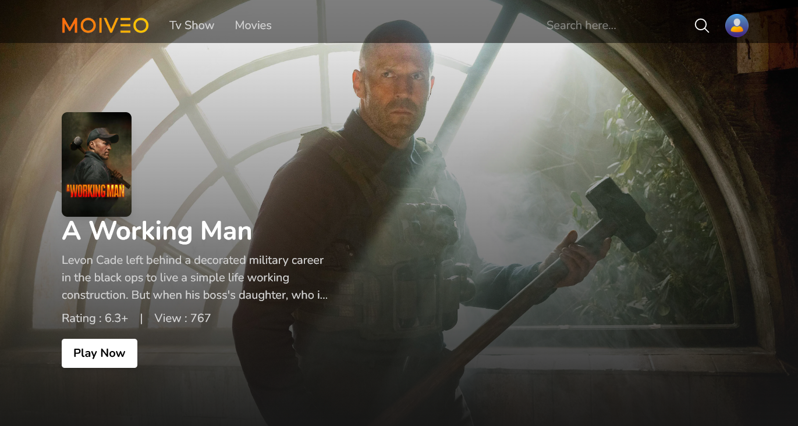

# 🎬 Movie App

A clean and modern movie app built with React. Browse movies, view details, cast, trailers, and recommendations.

## 📸 Preview

## 

## Tech Stack

- **React**
- **Redux** – State management
- **React Router DOM** – Client-side routing
- **TailwindCSS** – Utility-first CSS framework
- **Moment.js** – Date formatting
- **The Movie Database API (TMDB)** – Movie data source
- **React Icons** – Icon library

---

## Features

- Explore movie and TV show details
- View cast, director, and writer info
- Play trailers directly inside the app
- Browse similar and recommended titles
- Fully responsive layout for all screen sizes

---

## 🛠️ Getting Started

To run the project locally:

# 2. Install dependencies

npm install

# 3. Start the development server

npm run dev
